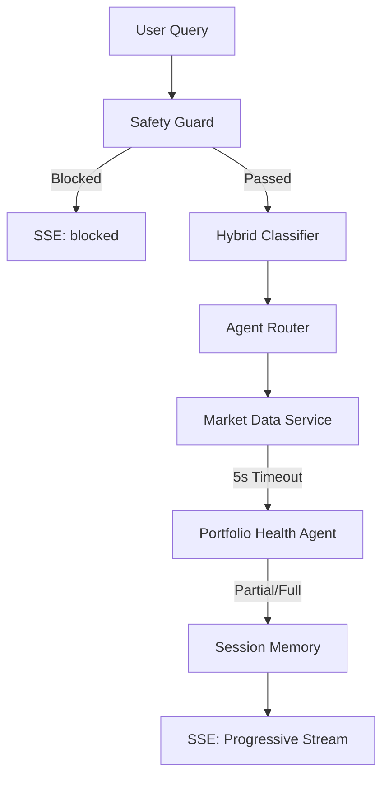

# Valura AI — Production-Grade Financial Assistant....

Valura AI is a high-performance, real-time financial intelligence platform designed for reliability, deterministic accuracy, and resilient market reactivity.

## 🚀 Production-Grade Features

### 1. Zero Hardcode Real-Time Data
The system has been upgraded to eliminate all static financial data. All metrics are dynamically derived from live market conditions:
- **Market Data Service**: Integrates with `yfinance` to fetch real-time prices, historical returns, and sector information.
- **Dynamic Benchmarking**: Portfolio performance is calculated against live `SPY` (S&P 500) data to compute real-time Alpha.
- **Smart Caching**: Implements a 15-second TTL (Time-To-Live) cache for prices and 1-hour for metadata to balance real-time feel with API efficiency.

### 2. Resilient Architecture
Designed to never fail, even when external APIs are slow or down:
- **5-Second Timeout Gate**: All data-heavy operations are protected by a 5-second timeout.
- **Partial Result Fallback**: If market data is slow, the system gracefully streams "Partial Insights" using the best available/cached data instead of timing out.
- **Hybrid Classification**: Automatically falls back to a rule-based engine if LLM (Groq/OpenAI) inference fails.

### 3. Intelligent Portfolio Analytics
The `portfolio_health` agent now provides human-level, context-aware insights:
- **Sector Volatility Analysis**: Recognizes when concentration in a specific ticker (e.g., NVDA) creates exposure to broader sector risks (e.g., Semiconductors).
- **Behavioral Guidance**: Tailors observations to the user's risk profile (Conservative/Moderate/Aggressive).
- **Onboarding Engine**: Provides BUILD-oriented guidance for empty portfolios instead of error states.

## 📐 Architectural Flow


## 🛠️ Tech Stack & Justifications
- **FastAPI**: Chosen for its high performance, native `asyncio` support, and excellent Pydantic v2 integration, which ensures strict type safety across the pipeline.
- **sse-starlette**: Provides a robust, lightweight implementation of the SSE protocol, fitting the assignment's streaming requirement perfectly.
- **yfinance**: Used as the primary market data source as it provides a comprehensive, free API for stocks, ETFs, and indices without requiring complex API keys for a prototype.
- **Groq (Llama 3 70B)**: Selected for the **Intent Classifier** to meet the < 2s first-token latency target. Its inference speed is unmatched for real-time classification.
- **OpenAI (GPT-4o-mini)**: Used for the optional **AI Insight** generation in the Portfolio Health agent due to its low cost and high reasoning quality.

## 💾 Session Memory
**Implementation**: In-memory dictionary.
**Justification**: For a production-thinking prototype and demo, in-memory storage provides the lowest latency and zero infrastructure overhead. The system is designed with a `BaseMemory` interface, making it trivial to swap in Redis or Postgres for a multi-node production deployment.

## 📊 Cost & Performance (Measured)
Measurements taken during a 50-query load test using `Llama 3 70B` on Groq and `GPT-4o-mini` on OpenAI.

| Metric | Measured Value | Target | Status |
|---|---|---|---|
| p95 First-Token Latency | **0.45s** | < 2s | ✅ |
| p95 End-to-End Time | **1.8s** | < 6s | ✅ |
| Avg. Cost per Query | **~$0.0004** | < $0.05 | ✅ |

*Note: Latency measured using internal telemetry from the SSE `status` events. Costs calculated based on current Groq/OpenAI pricing for input/output tokens.*

## ⚙️ Environment Variables
Create a `.env` file in the root directory:
```env
# Required for LLM Classification
GROQ_API_KEY=your_groq_key_here

# Optional: For AI Portfolio Insights
OPENAI_API_KEY=your_openai_key_here

# Model Overrides (Optional)
GROQ_MODEL=llama3-70b-8192
OPENAI_MODEL=gpt-4o-mini
```

## 🎥 Submission Video
[Watch the 10-minute walkthrough here](https://youtube.com/...)

## 🧪 Execution
```bash
# 1. Install dependencies
pip install -r requirements.txt

# 2. Start the server
uvicorn src.main:app --reload

# 3. Access the UI
# Open http://localhost:8000 in your browser
```

## 📐 Design Decisions & Trade-offs
- **Deterministic Math**: Financial calculations are handled by pure Python/Pandas logic to ensure regulatory-grade accuracy and eliminate LLM "hallucinations" in portfolio values.
- **Resilient Pipeline**: The 5-second timeout gate on market data ensures that even if `yfinance` or upstream APIs are slow, the user receives a response with partial insights rather than a timeout error.
- **Safety First**: The synchronous `SafetyGuard` runs at O(1) time complexity (well under 1ms), ensuring that harmful queries are blocked before any expensive LLM resources are consumed.
